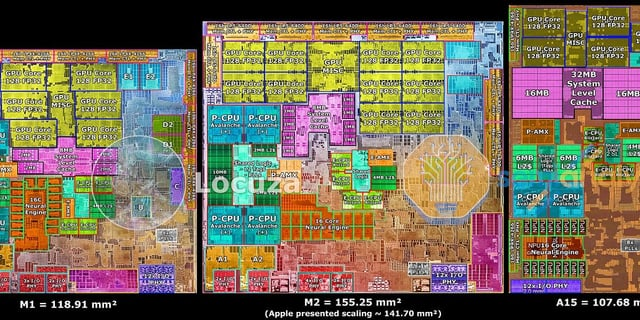
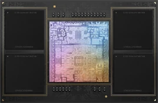
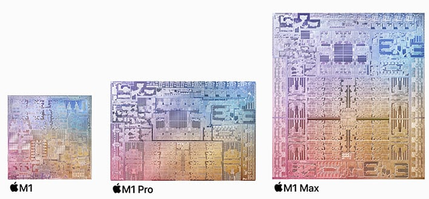
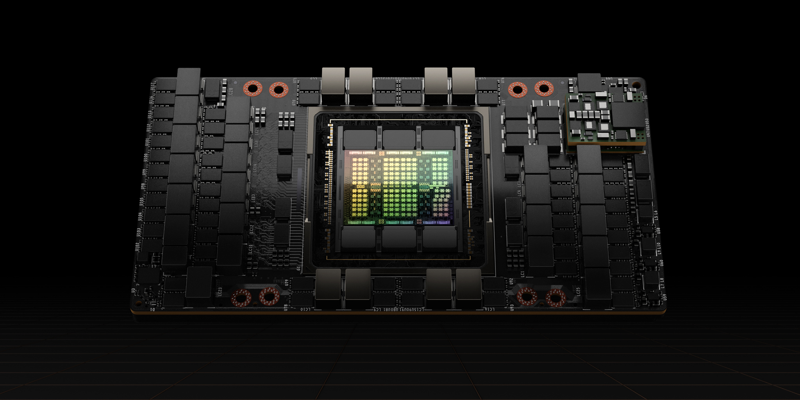
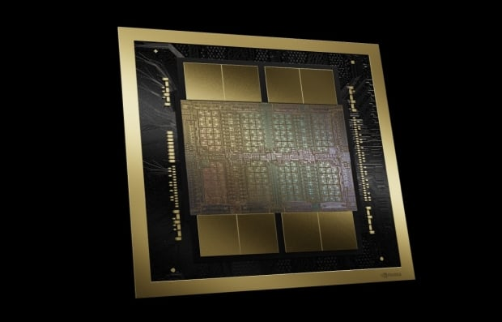
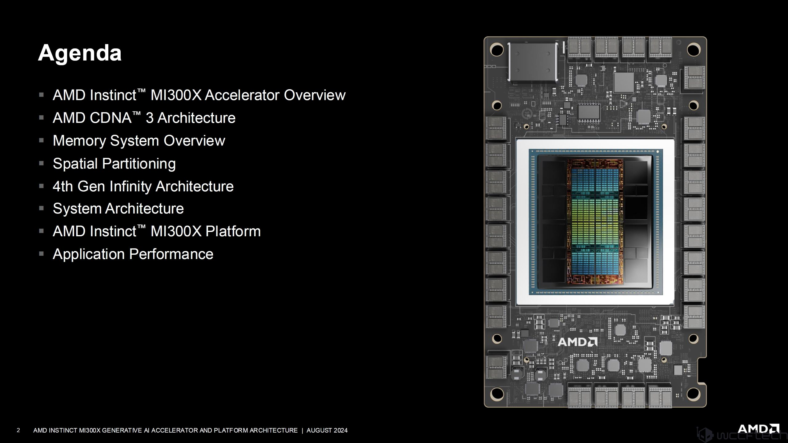
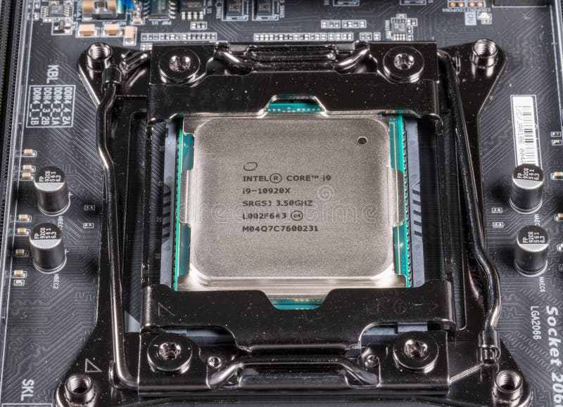

# llm.cpp

<h1 align="center">
  

[](https://github.com/LMGNU/llm.cpp/releases) [](https://www.gnu.org/licenses/gpl-3.0) [](...)  [](https://github.com/LMGNU/llm.cpp/actions/workflows/ci-approval.yml) [](https://github.com/LMGNU/llm.cpp/actions/workflows/docker-publish.yml) 

</h1>


This project implements language models in dependency-free C++, eliminating the need for PyTorch or Python to train a transformer locally. The core implementation is a decoder-only ***GPT architecture*** featuring custom tensors, embeddings, multi-head causal self-attention, layer normalization, cross-entropy loss, and an analytical backward pass with the AdamW optimizer - all contained within [main.cpp](main.cpp) ,[llm.mm](llm.mm) and the [include/](include) directory also a ***token level [BPE]*** [tokenizer.h](include/tokenizer.h) implementation inside [include](include). With no autograd engine or external frameworks, every gradient is explicitly derived and written out.
The model achieves a validation loss of 1.6371 nats after 76 minutes of CPU training on 31.4 million characters, demonstrating that character-level language modeling at this scale is highly tractable on commodity hardware without external dependencies. On a GPU (CUDA/bfloat16), a validation loss of 2.3918 is reached in under 83 minutes, achieving a peak throughput of 19.6k tokens per second.

## Board
| S.No. | time | val_bpb / Metric | scale | Date | Contributors |
|---|-------------|------------------|-------|------|--------------|
| 1 | 168 hours | 29.41 PPL (~0.93 BPB) | 124M (32x TPU v3) | Feb 2019 | OpenAI (GPT-2 Small) |
| 2 | 45 min | 3.28 Val Loss (~0.748 BPB) | 124M (8x H100) | May 2024 | Andrej Karpathy (llm.c) |
| 3 | 2.98 min | 3.28 Val Loss (~0.748 BPB) | 124M (8x H100) | Feb 2025 | Keller Jordan et al. (Modded-NanoGPT) |
| 4 | 72 hours | 22.7 PPL (~0.85 BPB) | 125M (32x A100) | Feb 2024 | Meta (MobileLLM-125M) |
| 5 | ~24 hours | ~1.02 BPB | 135M (64x H100) | Jul 2024 | Hugging Face (SmolLM-135M) |
| 6 | 61.3 min | 0.7176 | 10.82M (T4) | Mar 2026 | @Eamon2009 |
| 7 | 6.1 min | 0.9250 | 1.99M (T4) | Feb 2026 | @Eamon2009 |
| 8 | 39.4 min | 1.3145 | 0.82M (CPU) | July 2026 | @Eamon2009 |
| 9 | 76.2 min | 1.6371 | 0.82M (CPU) | Jan 2026 | @Eamon2009 |

More broadly, the primary contribution of this work lies in its absolute transparency. Every gradient in the backward pass is explicitly written and readable, and every tensor operation is a standard C++ function. By exposing exactly what frameworks like PyTorch compute under the hood, this implementation provides a clear educational pathway. We believe that this fundamental understanding is the true foundation of genuine expertise in deep learning.
Alongside it sits a parallel PyTorch implementation in [engine/main.py](engine/main.py) and [engine/inference.py](engine/inference.py), so you can train and generate the same architecture with `torch` + `tiktoken` when you want speed instead of transparency. There's also an experimental integrated-GPU path in [iGPU/](engine/iGPU/). The point of this repo is the C++ core. The PyTorch exist to make the model usable, but if you're here to ***train a GPT without a framework*** doing the work for you, [include/backward.h](include/backward.h) is where to start reading.

---

## From CPU to GPU
The custom C++ backend is transparent but slow: a CPU executes scalar matrix multiplication at roughly 1-10 GFLOP/s. An NVIDIA RTX 4090 delivers ∼80 TFLOP/s-an 8,000–80,000× speedup for the same computation.The LibTorch port replaces the custom backend with PyTorch’s C++ API, gaining cuBLAS-accelerated matrix operations. The transformer architecture remains unchanged only the compute layer is modified. A single line migrates
the model to GPU:
```cpp
model->to(torch::kCUDA)
```


which transfers all parameters to GPU memory; all subsequent `torch::matmul` calls dispatch to cuBLAS automatically.
***technical notes***: [docs](https://eamon2009.github.io/LLMs/)

---

## quick start (CPU)

The fastest way to see the whole pipeline - tokenize, train, checkpoint, generate - using the bundled character-level corpus:

get the data set first :

``` shell
cd data             # you set the file size for data set
python data_set.py  # also get any dataset from hugging face datasets 
```

```bash
# run this 
g++ -std=c++17 -O3 -march=native -fopenmp -I. -Iinclude -o llm.exe main.cpp
./llm.exe data/input.txt
```
should see something like this 
```text

██╗     ██╗     ███╗   ███╗        ██████╗ ██████╗ ██████╗
██║     ██║     ████╗ ████║       ██╔════╝ ██╔══██╗██╔══██╗
██║     ██║     ██╔████╔██║ █████╗██║      ██████╔╝██████╔╝
██║     ██║     ██║╚██╔╝██║ ╚════╝██║      ██╔═══╝ ██╔═══╝
███████╗███████╗██║ ╚═╝ ██║ █████╗╚██████╗ ██║     ██║
╚══════╝╚══════╝╚═╝     ╚═╝ ╚════╝ ╚═════╝ ╚═╝     ╚═╝

[BPE]   Text length: 11109973 characters
[BPE]   Target vocab size: 2056
[BPE]   Cached vocab to data/input.txt.tokenizer.bin
[DATA]  Total tokens : 11109973
[DATA]  Train tokens : 9998975
[DATA]  Val tokens   : 1110998
+-----------------------------------------------------------------------------+
| LLM.cpp                                                                     |
|======================================+======================================|
| Parameter / Spec                     | Value                                |
|--------------------------------------+--------------------------------------|
| Host CPU Device                      | AMD Ryzen 5 PRO....                  |
| Host RAM (Total)                     | 6045 MB                              |
| Max Sequence Length                  | 64                                   |
| Vocab Size (BPE Merges)              | 2244                                 |
| Number of Layers                     | 4                                    |
| Number of Heads                      | 2                                    |
| Channels (Embeddings)                | 128                                  |
| Number of Parameters                 | 1376708                              |
| Repetition Penalty                   | 10                                   |
| Repetition Window                    | 10                                   |
+--------------------------------------+--------------------------------------+
step 1/5000 | train loss 7.693331 | val loss 7.692642 | lr 5.00e-04 |  5949.88 ms | 344 tok/s | ram 224.3 MB
step 2/5000 | train loss 7.225118 | val loss 7.692642 | lr 5.00e-04 |  6058.38 ms | 338 tok/s | ram 224.0 MB
step 3/5000 | train loss 7.061631 | val loss 7.692642 | lr 5.00e-04 |  5943.76 ms | 344 tok/s | ram 223.5 MB
step 4/5000 | train loss 6.966476 | val loss 7.692642 | lr 5.00e-04 |  6059.61 ms | 337 tok/s | ram 225.0 MB
step 5/5000 | train loss 6.856962 | val loss 7.643652 | lr 5.00e-04 |  5931.75 ms | 345 tok/s | ram 224.5 MB
```

This trains from scratch on `data/input.txt` and writes the best checkpoint to `best_model.bin`. Once you have a checkpoint, generate or chat with it:

```bash
./llm.exe data/input.txt --generate
./llm.exe data/input.txt --chat --chat-tokens 300
```

debugging tip: drop `-O2` for `-g` when compiling if you want to step through `include/backward.h` or `include/gpt.h` in a debugger — the manual backward pass is much easier to follow one breakpoint at a time.

### runtime arguments

```bash
llm.exe [data_path] [--generate] [--chat] [--chat-tokens N]
```
###  PyTorch (single-GPU + CPU)
```bash
# to train
cd engine
python main.py 
# for inference stay in engine/
python inference.py
```
### Multi-GPU
Single GPU or CPU Mode (Default Fallback)
If you do not pass any distributed environment parameters, the script automatically defaults to running locally on a single GPU (if available) or CPU.
```bash
cd engine
cd distributed
python train.py
```
### Single-Node Multi-GPU Training (DDP via torchrun)
To train using multiple GPUs on a single machine, use PyTorch's torchrun launcher. Replace --nproc_per_node with the number of GPUs available on your machine (e.g., 2, 4, or 8).
```bash
cd engine
cd distributed
# Example: Running on 4 GPUs on a single machine
torchrun --standalone --nproc_per_node=4 train.py
```
---
## Hardware 

Optimized for any hardware - from your laptop CPU to a GPU.
<table>
  <tr>
    <th colspan="4"><h3>Apple Silicon</h3></th>
  </tr>
  <tr>
    <td align="center"><br/><b>Apple Silicon</b><br/>M1–M4 · Metal</td>
    <td align="center"><br/><b>M Pro</b><br/>19-core GPU · Metal</td>
    <td align="center"><br/><b>M Max</b><br/>40-core GPU · Metal</td>
    <td align="center"><br/><b>M Ultra</b><br/>76-core GPU · Metal</td>
  </tr>
  <tr>
    <th colspan="4"><h3>NVIDIA</h3></th>
  </tr>
  <tr>
    <td align="center"><br/><b>H100</b><br/>SXM5 · NVLink · 80 GB HBM3</td>
    <td align="center"><br/><b>A100</b><br/>SXM4 · 80 GB HBM2e</td>
    <td align="center"><br/><b>B200</b><br/>Blackwell · 192 GB HBM3e</td>
    <td align="center"><br/><b>T4</b><br/>CUDA · Cloud · Colab</td>
  </tr>
  <tr>
    <th colspan="4"><h3>AMD & CPU</h3></th>
  </tr>
  <tr>
    <td align="center"><br/><b>Radeon RX</b><br/>ROCm · RDNA3</td>
    <td align="center"><br/><b>MI300X</b><br/>ROCm · 192 GB HBM3</td>
    <td align="center" colspan="2"><br/><b>CPU (x86-64)</b><br/>OpenMP · AVX · Zero install</td>
  </tr>
</table>

***Note: No over-promising of anything***

---

## File structure

```text
## Structure

```text
.
├── .devops/                        # DevOps, Docker, & proxy configurations
│   ├── docker-compose.dev.yml      # Local development compose setup
│   ├── docker-compose.gpu.yml      # Compose setup with GPU acceleration
│   ├── docker-compose.yml          # Base Docker Compose file
│   ├── Dockerfile                  # Primary build setup
│   ├── Dockerfile.backend          # Backend service Docker setup
│   ├── Dockerfile.cpp              # Native C++ build container setup
│   ├── Dockerfile.frontend         # Frontend UI Docker setup
│   └── nginx.conf                  # Reverse proxy configuration
│
├── .github/                        # GitHub Actions CI/CD workflows & repository templates
│   ├── ISSUE_TEMPLATE/             # Bug report & feature request templates
│   │   ├── bug_report.md
│   │   ├── config.yml
│   │   └── feature_request.md
│   ├── workflows/                  # CI/CD automation pipelines
│   │   ├── check.yml
│   │   ├── ci-approval.yml
│   │   ├── ci.yml
│   │   ├── docker-publish.yml
│   │   ├── jekyll-gh-pages.yml
│   │   ├── main.yml
│   │   ├── pr-check.yml
│   │   ├── release.yml
│   │   └── test.yml
│   ├── dependabot.yml              # Automated dependency update configuration
│   └── pull_request_template.md    # Pull request contribution template
│
├── assets/                         # Visual execution benchmarks & screenshots
│   ├── run_2026-07-16 165731.png
│   ├── run_20260430_192930.png
│   ├── run_20260508_110726.png
│   └── run_20260530_165216 (1).png
│
├── benches/                        # Performance benchmarking suite
│   └── bench.cpp                   # C++ benchmark execution script
│
├── config/                         # Global project configurations
│   └── config.h                    # C++ global configuration header
│
├── data/                           # Dataset ingestion scripts & raw samples
│   ├── data_set.py                 # Data loader preparation script
│   └── input.txt                   # Sample raw dataset text
│
├── docs/                           # Documentation media & report graphics
│   └── training_report.png         # Model training performance chart
│
├── engine/                         # Core execution & inference engines
│   ├── distributed/                # Multi-node / distributed training & inference
│   │   ├── infer.py                # Distributed inference pipeline
│   │   └── train.py                # Distributed training pipeline
│   ├── llm.cpp/                    # Low-level CUDA/C++ runtime engine
│   │   ├── config/                 # Engine-specific configurations
│   │   ├── include/                # CUDA kernels & C++ architecture headers
│   │   ├── best_model.bin          # Trained binary weights checkpoint
│   │   ├── llm.cu                  # CUDA GPU execution source
│   │   ├── llm.exe                 # Compiled engine binary executable
│   │   ├── llm.py                  # Engine Python bindings/wrapper
│   │   ├── Makefile                # Engine build compilation setup
│   │   └── train.mm                # Metal training harness
│   ├── logs/                       # Execution log files
│   ├── inference.py                # Python model inference entry point
│   ├── main.py                     # Primary Python execution entry point
│   └── llm.pt                      # Pretrained PyTorch model checkpoint
│
├── include/                        # Core C++ neural network architecture headers
│   ├── attention.h                 # Multi-head attention implementation
│   ├── backward.h                  # Backpropagation & gradient calculation utilities
│   ├── block.h                     # Transformer block assembly
│   ├── embedding.h                 # Token & positional embedding logic
│   ├── feedforward.h               # Feed-forward layer implementation
│   ├── gpt.h                       # Full GPT transformer architecture layout
│   ├── layernorm.h                 # Layer normalization operations
│   ├── linear.h                    # Fully connected dense layer
│   ├── lm.h                        # High-level language model interface
│   ├── sampler.h                   # Token sampling routines (Top-K, Top-P, Temperature)
│   ├── tensor.h                    # Multidimensional array data structures
│   ├── tokenizer.h                 # Text tokenization logic
│   └── torch_bridge.h              # PyTorch interoperability layer
│
├── scripts/                        # Automation & compilation scripts
│
```
---

| Argument | Description |
|---|---|
| `data_path` | Plain-text corpus used to build the tokenizer and train/validation split |
| `--generate` | Load weights and continuously generate text |
| `--chat` | Load weights and start interactive terminal chat |
| `--chat-tokens N` | Max generated tokens per chat response |

| Env var | Default | Description |
|---|---|---|
| `GPT_DATA_PATH` | `data/input.txt` | Override the default training corpus |
| `GPT_MODEL_PATH` | `best_model.bin` | Override the checkpoint path |

## What's Actually Implemented in C++

No third-party runtime dependency - it builds from `main.cpp`, `config/config.h`, and `include/*.h` alone.

- **Byte Pair Encoding (BPE) Tokenizer** - Built entirely from scratch. Compiles a custom vocabulary directly from the training corpus by running iterative token-pair merges until it hits a targeted vocabulary threshold.
- Train/validation split via `DataLoader`
- Token + positional embeddings
- Multi-head causal self-attention with explicit QKV projections
- Pre-layer-norm residual transformer blocks
- Feed-forward MLP with ReLU
- Cross-entropy loss
- **Fully analytical backward pass** - every gradient (attention, layer norm, MLP, embeddings) is derived mathematically and coded explicitly in `include/backward.h`, not autograd
- AdamW optimizer (first/second moment estimates, weight decay)
- Checkpoint save/load
- Autoregressive generation and terminal chat mode

Hyperparameters live in `engine/llm.cpp/config/config.h` and require a rebuild to take effect:

```cpp
// note: The c++ version only runs on cpu not on GPU
static const unsigned int SEED = 1337;
static const double TRAIN_SPLIT = 0.9;
static const int BATCH_SIZE = 32; 
static const int BLOCK_SIZE = 64; 
static const int MAX_ITERS = 5000;
static const int EVAL_INTERVAL = 500;
static const float LEARNING_RATE = 5e-4f;
static const int EVAL_ITERS = 25; 
static const int N_EMBD = 128;   
static const int N_HEAD = 2;      
static const int N_LAYER = 4;
static const float DROPOUT = 0.05f;
static const int BPE_VOCAB_SIZE = 2048; 
```


## the PyTorch reference path

[engine/main.py](engine/main.py) trains the same architectural idea with `torch`, `torch.nn`, and GPT-4 BPE tokenization via `tiktoken`, useful when you want to scale past what C++ loops can comfortably train on CPU.

```bash
cd engine
python fineweb_dataset.py # you can also use data/input.txt also 
python main.py
```

It looks for `engine/input.txt` by default; point it elsewhere with `QUADTRIX_TRAIN_DATA` if needed. Run inference against a saved checkpoint:

```bash
python engine/inference.py --checkpoint engine/best_model.pt --prompt "Once upon a time" --max-new-tokens 100
```

## Benchmarks
### Runs at a Glance

| Metric            | Character-Level | Small Scale | Large Scale |
|-------------------|------------------|-------------|-------------|
| Parameters        | 0.83M            | 2.00M       | 19.17M      |
| Layers            | 4                | 4           | 4           |
| Embedding dim     | 128              | 200         | 200         |
| Attention heads   | 4                | 4           | 4           |
| Context length    | 64               | 200         | 200         |
| Vocab             | 105 char         | 110 char    | ~50K BPE    |
| Corpus            | TinyStories      | TinyStories | Children's Stories |
| Iterations        | 3,000            | 5,000       | 5,000       |
| Train loss        | 1.5632           | 0.9045      | —           |
| Val loss          | 1.6371           | 0.9301      | —           |
| Gen. gap          | 0.0739           | 0.0256      | —           |

See [run.md](run.md) and the leaderboard in the full docs for more configurations.

## how this differs from similar projects

| Project | Focus | Language | Autograd |
|---|---|---|---|
| nanoGPT / minGPT | Minimal, educational GPT training | Python | PyTorch |
| llama2.c | Inference-only | C | None |
| **llm.cpp** | Training *and* inference, manual backward pass | C++ / Python | Manual (C++) + PyTorch |

I'd like the C++ core (`main.cpp`, `include/`, `config/`) to stay dependency-free and to stay the part of this repo that explin transformer internals directly. The PyTorch engine, include, and ci are welcome to grow more features, integrations, and CI polish. If you build a port to another language or framework, I'm happy to link to it from a notable-forks section; just open an issue or PR.

## references

- Vaswani et al., ["Attention Is All You Need"](https://arxiv.org/abs/1706.03762), 2017
- Radford et al., ["Language Models are Unsupervised Multitask Learners"](https://cdn.openai.com/better-language-models/language_models_are_unsupervised_multitask_learners.pdf) (GPT-2 technical work), 2019
- Brown et al., ["Language Models are Few-Shot Learners"](https://arxiv.org/abs/2005.14165) (GPT-3 paper), 2020
- Meta AI, ["The Llama 3 Herd of Models"](https://arxiv.org/abs/2407.21783) (Llama 3 paper), 2024
- Andrej Karpathy, [nanoGPT](https://github.com/karpathy/nanoGPT) repository as an educational reference point
- [HuggingFace Datasets](https://huggingface.co/datasets) for FineWeb and other pretraining/fine-tuning datasets

## Cite

If you find llm.cpp helpful in your research cite as:
```bibtex
@misc{llm.cpp,
  author = {Eamon Sippy},
  title = {llm.cpp: LLM training in C++ \& Python},
  year = {2026},
  publisher = {GitHub},
  journal = {GitHub repository},
  url = {https://github.com/LMGNU/llm.cpp}
}

```


## license

GPL-3.0

