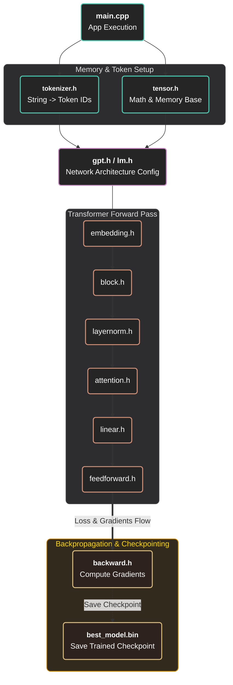

# llm.cpp

<h1 align="center">
  
 


[](https://github.com/LMGNU/llm.cpp/actions/workflows/ci-approval.yml) [](https://github.com/LMGNU/llm.cpp/releases) [](https://www.gnu.org/licenses/gpl-3.0) 
</h1>


**llm.cpp** trains real language models in pure C++ - no PyTorch, no Python, no dependencies whatsoever. Just a single decoder-only GPT built from scratch: custom tensors, embeddings, multi-head causal self-attention, layer normalization, cross-entropy loss, and a hand-rolled backward pass with AdamW. Every gradient is derived by hand and written out explicitly  no autograd magic, no black boxes.The whole thing lives in just three places: [main.cpp](main.cpp), [llm.mm](llm.mm), and the [include/](include) directory. There's also a token-level BPE tokenizer tucked away in [include/tokenizer.h](include/tokenizer.h), built the same way from the ground up. On the CPU, it trains to a validation loss of **1.6371 nats** in about **76 minutes** on **31.4 million characters**. That's character-level language modeling, running comfortably on ordinary hardware, with nothing but C++ and patience.On GPU with CUDA and bfloat16, it hits **2.3918 validation loss** in under **83 minutes**, peaking at **19.6k tokens per second**. Not bad for zero dependencies.

## Board
| S.No. | time | val_bpb / Metric | scale | Date | Contributors |
|---|-------------|------------------|-------|------|--------------|
| 1 | 168 hours | 29.41 PPL (~0.93 BPB) | 124M (32x TPU v3) | Feb 2019 | OpenAI (GPT-2 Small) |
| 2 | 45 min | 3.28 Val Loss (~0.748 BPB) | 124M (8x H100) | May 2024 | Andrej Karpathy (llm.c) |
| 3 | 2.98 min | 3.28 Val Loss (~0.748 BPB) | 124M (8x H100) | Feb 2025 | Keller Jordan et al. (Modded-NanoGPT) |
| 4 | 72 hours | 22.7 PPL (~0.85 BPB) | 125M (32x A100) | Feb 2024 | Meta (MobileLLM-125M) |
| 5 | ~24 hours | ~1.02 BPB | 135M (64x H100) | Jul 2024 | Hugging Face (SmolLM-135M) |
| 6 | 61.3 min | 0.7176 | 10.82M (T4) | Mar 2026 | Eamon |
| 7 | 6.1 min | 0.9250 | 1.99M (T4) | Feb 2026 | Eamon |
| 8 | 39.4 min | 1.3145 | 0.82M (CPU) | July 2026 | Eamon |
| 9 | 76.2 min | 1.6371 | 0.82M (CPU) | Jan 2026 | Eamon |

More broadly, The core computational engine of this repository is its custom C++ backend. While the PyTorch bindings are provided as a high-level API to make the model *usable* for inference and weight initialization, if your objective is to **execute an end-to-end GPT training loop independent of automated framework abstractions**, start with [include/backward.h](include/backward.h). This header explicitly defines the framework-agnostic backpropagation primitives and optimizer steps, computing the gradient flows and parameter updates directly without relying on PyTorch's internal `autograd` engine.

---

## From CPU to GPU
The custom C++ backend is transparent but slow: a CPU executes scalar matrix multiplication at roughly 1-10 GFLOP/sec. An NVIDIA RTX 4090 delivers ∼80 TFLOP/s-an 8,000 - 80,000× speedup for the same computation.The LibTorch port replaces the custom backend with PyTorch’s C++ API, gaining cuBLAS-accelerated matrix operations. The transformer architecture remains unchanged only the compute layer is modified. A single line migrates
the model to GPU:
```cpp
model->to(torch::kCUDA)
```


which transfers all parameters to GPU memory; all subsequent `torch::matmul` calls dispatch to cuBLAS automatically.
***visit web***: [llm.app](https://lmgnu.github.io/llm.app)


---

## quick start (CPU)
<h1 align="center">

</h1>


The fastest way to see the whole pipeline - tokenize, train, checkpoint, generate - using the bundled character-level corpus:

get the data set first :

``` shell
cd data             # you set the file size for data set
python data_set.py  # also get any dataset from hugging face datasets 
```

```bash
# run this 
g++ -std=c++17 -O3 -march=native -fopenmp -I. -Iinclude -o llm.exe main.cpp
./llm.exe data/input.txt
```
should see something like this 
```logs

  +------------------------------------------+------------------------------------------+
  | LLM Architecture                                                                    |
  +------------------------------------------+------------------------------------------+
  | Max Context Length   : 64                | Vocab Size (BPE)     : 2056              |
  | Number of Layers     : 4                 | Attention Heads      : 2                 |
  | Embedding Channels   : 128               | Total Parameters     : 1328392           |
  | Repetition Penalty   : 10                | Repetition Window    : 10                |
  +------------------------------------------+------------------------------------------+

  +-------------------------------------------------------------------------------------+
  | Host Hardware Specs                                                                 |
  +-------------------------------------------------------------------------------------+
  | Host CPU Device      : AMD Ryzen                                                    |
  | Host RAM (Total)     : 8045 MB                                                      |
  +-------------------------------------------------------------------------------------+

step 1/5000(0.02%) | train loss 7.650238 | val loss 7.652169  | lr 1.00e-06 |  4016.84 ms |  509 tok/s
| ram 189.6 MB
step 2/5000(0.04%) | train loss 7.648808 | val loss 7.652169  | lr 2.00e-06 |  4053.90 ms |  505 tok/s
| ram 190.7 MB
step 3/5000(0.06%) | train loss 7.658056 | val loss 7.652169  | lr 3.00e-06 |  4381.06 ms |  467 tok/s
| ram 190.7 MB
step 4/5000(0.08%) | train loss 7.648185 | val loss 7.652169  | lr 4.00e-06 |  4514.13 ms |  453 tok/s
| ram 189.8 MB
step 5/5000(0.10%) | train loss 7.646149 | val loss 7.652169  | lr 5.00e-06 |  4429.38 ms |  462 tok/s
| ram 190.3 MB
```

This trains from scratch on `data/input.txt` and writes the best checkpoint to `best_model.bin`. Once you have a checkpoint, generate or chat with it:

```bash
./llm.exe data/input.txt --generate
./llm.exe data/input.txt --chat --chat-tokens 300
```

debugging tip: drop `-O2` for `-g` when compiling if you want to step through `include/backward.h` or `include/gpt.h` in a debugger - the manual backward pass is much easier to follow one breakpoint at a time.

### runtime arguments

```bash
llm.exe [data_path] [--generate] [--chat] [--chat-tokens N]
```
---

## How the Training Actually Works

In `backward.h`, every gradient is computed . No autograd. No `.backward()` magic. Just C++ loops that do exactly what the math says.
| File | What It Does |
|------|-------------|
| `backward.h` | The full backward pass, the optimizer, and all the gradient bookkeeping. This is where the model actually learns. |

### The Gradient Accumulators

Before we can update anything, we need somewhere to store the gradients. The `Grad*` structs are just containers - `GradLinear` for weight and bias gradients, `GradEmbedding` for lookup tables, `GradLayerNorm` for scale and shift, and so on. They nest together: `GradHead` holds three `GradLinear`s (for Q, K, V), `GradMHA` holds all the heads plus the output projection, `GradBlock` holds the attention + feedforward + two layer norms, and `Grads` holds the whole model. Each one has a `zero()` method to clear gradients between batches.

### The Activation Cache

To compute gradients, you need to remember what happened during the forward pass. The `Saved*` structs stash exactly that: pre-softmax attention scores, post-softmax weights, dropout masks, ReLU inputs, layer norm means and inverse standard deviations, and every intermediate tensor. `SavedForward` is the big one - it captures the entire forward pass so the backward pass can walk back through it in reverse.

### The Backward Functions

Each operation has its own backward function, and they chain together:

- **`backward_cross_entropy`** - starts the whole thing. Takes the raw logits and the target tokens, computes softmax probabilities, subtracts 1 from the correct class, and divides by batch size. This is `dLoss/dLogits`.
- **`backward_linear`** - given the upstream gradient, the input `x`, and the weight matrix `W`, computes gradients for `W` and `b` (if present) and passes the gradient back to `x`.
- **`backward_layernorm`** - the full LayerNorm backward from the Ba et al. paper. Computes `dgamma`, `dbeta`, and the input gradient using the cached mean and inverse standard deviation.
- **`backward_relu`** - dead simple: if the pre-activation was negative, the gradient is zero. Otherwise it passes through unchanged.
- **`backward_dropout`** - scales the surviving gradients by `1/(1-p)` and zeros out the dropped ones.
- **`backward_bmm`** - batched matrix multiply backward. Uses the standard chain rule: `dA = dOut @ B^T`, `dB = A^T @ dOut`.
- **`backward_softmax3d`** - the trickiest one. For each row, computes `wei * (dwei - sum(wei * dwei))`. This is the Jacobian of softmax in closed form.
- **`backward_cat_last`** - splits the concatenated multi-head gradient back into per-head tensors.

### The Full Backward Pass

The `backward()` function is the heart of it. It walks the model in reverse:

1. **Loss gradient** -> `dlogits` from `backward_cross_entropy`
2. **LM head** -> `backward_linear`, then `backward_layernorm`
3. **For each block (in reverse)**:
   - FFN branch: dropout ->linear -> ReLU -> linear >- layer norm
   - Residual add
   - MHA branch: dropout> linear -> split heads -> for each head: dropout backward -> softmax backward ->scale -> Q/K/V backward -> accumulate into input gradient
   - Residual add
   - Layer norm backward
4. **Embeddings** -> gradients flow into both token and position embedding tables

Every gradient is accumulated, not overwritten. This matters if you're doing gradient accumulation across multiple mini-batches.

### The Optimizer

`AdamWState` tracks first and second moment estimates (`m` and `v`) for every parameter. `build_optimizer()` registers all model parameters in order - embeddings, then each block's Q/K/V/projections, feedforward weights/biases, layer norm params, and finally the output head. `apply_grads()` does the actual update: bias-corrected moments, then `param -= lr * m_hat / (sqrt(v_hat) + eps)`. No weight decay in this version - it's vanilla Adam.
```python
loss.backward() # who???
```
## The Tokenizer: `tokenizer.h`

This is the data pipeline. It handles two very different modes: training BPE from raw text, or streaming pre-tokenized shards from disk. Both paths end up at the same place - a batch of token IDs ready to feed into the model.

### Two Modes, One Interface

| Mode | When to Use | What It Does |
|------|------------|-------------|
| **TEXT** | Small to medium datasets that fit in RAM | Reads a `.txt` file, trains BPE, stores everything in `std::vector&lt;int&gt;` |
| **SHARDED** | Large datasets (billions of tokens) | Memory-maps binary shards, streams tokens on demand, never loads the full dataset |

The `load()` method picks the mode automatically. Pass it a file -> TEXT mode. Pass it a directory -> SHARDED mode.

### TEXT Mode: Training BPE from Scratch

BPE starts simple. Every unique character becomes its own token. Then it runs merge operations - find the most common pair of adjacent tokens, merge them into a new token, repeat. The `train_bpe()` function does exactly this, using a linked-list structure (`BPEIndex`) to track active tokens and their neighbors. A hash map (`pair_pos`) keeps track of where each pair occurs, so finding the most frequent one is fast.

The merge table is cached to disk (`tokenizer.bin`) so you don't retrain every run. If the cached vocab matches your target size, it loads instantly. Otherwise it trains fresh and writes the cache.

Encoding text works in two passes: `base_encode()` turns characters into initial token IDs, then `apply_merges()` walks the merge table in order, greedily combining pairs. Decoding is the reverse - just look up each ID in the vocab and concatenate.

### SHARDED Mode: Streaming Billions of Tokens

For datasets too large for RAM, we pre-tokenize into binary shards. Each shard is a flat stream of `uint16_t` token IDs with a small header. The `uint16_t` format caps vocabulary at 65,536 entries - which covers every standard BPE config (32k, 50k, 64k) at half the footprint of `int32`. That means shards page in twice as fast.

The `MMapShard` struct handles the platform-specific memory mapping - `mmap` on POSIX, `MapViewOfFile` on Windows. It validates the shard header (magic number, version, token count) and exposes a pointer to the token data. Move-only semantics prevent accidental copies of file descriptors.

`ShardedSplit` manages a collection of shards. It builds a prefix-sum index over token counts, so `locate(global_idx)` tells you which shard a token lives in, and `token_at(global_idx)` fetches it in O(1). No scanning, no seeking - just pointer arithmetic.

### Batching

`get_batch()` samples random starting positions and extracts `block_size` consecutive tokens for inputs, with the next token as the target. In TEXT mode this is a simple vector slice. In SHARDED mode it uses the prefix-sum index to find the right shard, then either reads directly from the mapped memory (if the sequence fits in one shard) or falls back to `token_at()` (if it spans a boundary). OpenMP parallelizes across the batch dimension - each thread gets its own RNG seed to keep things deterministic.

### Writing Shards

If you start with a TEXT dataset and want to convert it to SHARDED, `write_shards()` splits the in-memory train/val data into fixed-size chunks, writes each as a binary file with the standard header, and copies the vocab alongside. This is a one-time preprocessing step that pays off every time you train.

### Why `uint16_t`?

Most tokenizers use `int32` for IDs. That's fine, but wasteful when your vocab is under 65k. `uint16_t` cuts shard size in half, which means half the disk I/O, half the memory bandwidth, and faster cache utilization during batching. The tradeoff is a hard vocab ceiling - but in practice, 65k tokens is plenty for most language models.

## File structure

```text

|-─ .ci/                        # CI/CD pipelines and Docker configurations
├── .github/                    # GitHub Actions workflows and issue templates
├── assets/                     # Project images, banners, and hardware diagrams
├── benches/
│   └── bench.cpp               # C++ benchmarking script for performance testing
├── config/
│   └── config.h                # Global configuration parameters
├── data/
│   ├── dataset.py              # Data loading and preprocessing pipeline
│   ├── data_set.py             # Alternative dataset handling logic
│   ├── export.py               # Script to export models or tensors
│   └── input.txt               # Raw text data used for training/testing
├── docs/                       # Additional documentation and generated reports
├── engine/                     # Core backend implementation
│   ├── llm.pt                  # Primary PyTorch model checkpoint
│   ├── mini-quadtrix.pt        # Minimal PyTorch model for testing
│   └── llm.cpp/                # Low-level C++/CUDA/Metal engine
│       ├── CMakeLists.txt      # Engine-specific build configuration
│       ├── llm.cu              # CUDA implementation for Nvidia GPUs
│       ├── make                # Engine Makefile compilation script
│       ├── train.mm            # Objective-C++ Metal script for Apple Silicon training
│       ├── config/
│       │   └── config.h        # Engine-specific configuration header
│       └── include/            # Neural network mathematical headers
│           ├── attention.h     # Self-attention module definitions
│           ├── cuda_kernels.cuh # Custom CUDA kernel definitions
│           ├── layer.cuh       # Layer abstractions for GPU
│           ├── tensor.cuh      # Core tensor math operations
│           └── ...             # (Other low-level neural net headers)
├── include/                    # High-level C++ API headers
│   ├── attention.h             # High-level attention interfaces
│   ├── gpt.h                   # GPT model architecture definitions
│   ├── llm-cpp.hpp             # Main library interface for external use
│   ├── tokenizer.h             # Text tokenization logic
│   └── torch_bridge.h          # Interoperability layer for PyTorch tensors
├── scripts/
│   └── build.sh                # Automation script for building the project
├── train_test/                 # Experimental and testing scripts
│   ├── model.py                # Python model architecture definitions
│   ├── test.c                  # C-based functional testing
│   └── train2.mm               # Experimental Metal training iterations
├── .clang-format               # Code style rules for C/C++ files
├── .clang-tidy                 # Linter configuration for C/C++ static analysis
├── benchmark.cpp               # Entry point for running system benchmarks
├── CMakeLists.txt              # Root CMake build configuration
├── llm.mm                      # Apple Silicon (Metal) main inference entry point
├── main.cpp                    # Main application C++ entry point
├── README.md                   # Main project documentation
├── requirements.txt            # Python dependencies for the project
└── shards.cpp                  # C++ implementation for handling data shards
```
---

| Argument | Description |
|---|---|
| `data_path` | Plain-text corpus used to build the tokenizer and train/validation split |
| `--generate` | Load weights and continuously generate text |
| `--chat` | Load weights and start interactive terminal chat |
| `--chat-tokens N` | Max generated tokens per chat response |

| Env var | Default | Description |
|---|---|---|
| `GPT_DATA_PATH` | `data/input.txt` | Override the default training corpus |
| `GPT_MODEL_PATH` | `best_model.bin` | Override the checkpoint path |

## What's Actually Implemented in C++

No third-party runtime dependency - it builds from `main.cpp`, `config/config.h`, and `include/*.h` alone.

- **Byte Pair Encoding (BPE) Tokenizer** - Built entirely from scratch. Compiles a custom vocabulary directly from the training corpus by running iterative token-pair merges until it hits a targeted vocabulary threshold.
- Train/validation split via `DataLoader`
- Token + positional embeddings
- Multi-head causal self-attention with explicit QKV projections
- Pre-layer-norm residual transformer blocks
- Feed-forward MLP with ReLU
- Cross-entropy loss
- **Fully analytical backward pass** - every gradient (attention, layer norm, MLP, embeddings) is derived mathematically and coded explicitly in `include/backward.h`, not autograd
- AdamW optimizer (first/second moment estimates, weight decay)
- Checkpoint save/load
- Autoregressive generation and terminal chat mode

Hyperparameters live in `engine/llm.cpp/config/config.h` and require a rebuild to take effect:

```cpp
// note: The c++ version only runs on cpu not on GPU
static const unsigned int SEED = 1337;
static const double TRAIN_SPLIT = 0.9;
static const int BATCH_SIZE = 32; 
static const int BLOCK_SIZE = 64; 
static const int MAX_ITERS = 5000;
static const int EVAL_INTERVAL = 500;
static const float LEARNING_RATE = 5e-4f;
static const int EVAL_ITERS = 25; 
static const int N_EMBD = 128;   
static const int N_HEAD = 2;      
static const int N_LAYER = 4;
static const float DROPOUT = 0.05f;
static const int BPE_VOCAB_SIZE = 2048; 
```

## Benchmarks
### Runs at a Glance

| Metric            | Character-Level | Small Scale | Large Scale |
|-------------------|------------------|-------------|-------------|
| Parameters        | 0.83M            | 2.00M       | 19.17M      |
| Layers            | 4                | 4           | 4           |
| Embedding dim     | 128              | 200         | 200         |
| Attention heads   | 4                | 4           | 4           |
| Context length    | 64               | 200         | 200         |
| Vocab             | 105 char         | 110 char    | ~50K BPE    |
| Corpus            | TinyStories      | TinyStories | Children's Stories |
| Iterations        | 3,000            | 5,000       | 5,000       |
| Train loss        | 1.5632           | 0.9045      | -           |
| Val loss          | 1.6371           | 0.9301      | -           |
| Gen. gap          | 0.0739           | 0.0256      | -           |

See [run.md](run.md) and the leaderboard in the full docs for more configurations.

## how this differs from similar projects

| Project | Focus | Language | Autograd |
|---|---|---|---|
| nanoGPT / minGPT | Minimal, educational GPT training | Python | PyTorch |
| llama2.c | Inference-only | C | None |
| **llm.cpp** | Training *and* inference, manual backward pass | C++  | C++ |

I'd like the C++ core (`main.cpp`, `include/`, `config/`) to stay dependency-free and to stay the part of this repo that explin transformer internals directly. The include, and ci are welcome to grow more features, integrations, and CI improvement.If you build a port to another language or framework, I'm happy to link to it from a notable-forks section; just open an issue or PR.

## references

- Vaswani et al., ["Attention Is All You Need"](https://arxiv.org/abs/1706.03762), 2017
- Radford et al., ["Language Models are Unsupervised Multitask Learners"](https://cdn.openai.com/better-language-models/language_models_are_unsupervised_multitask_learners.pdf) (GPT-2 technical work), 2019
- Brown et al., ["Language Models are Few-Shot Learners"](https://arxiv.org/abs/2005.14165) (GPT-3 paper), 2020
- Meta AI, ["The Llama 3 Herd of Models"](https://arxiv.org/abs/2407.21783) (Llama 3 paper), 2024
- Andrej Karpathy, [nanoGPT](https://github.com/karpathy/nanoGPT) repository as an educational reference point
- [HuggingFace Datasets](https://huggingface.co/datasets) for FineWeb and other pretraining/fine-tuning datasets
- Karpathy, A.** (2024). [*Let's reproduce GPT-2 (124M)*](https://youtu.be/l8pRSuU81PU)
 **Note: We express our thanks to Andrej Karpathy for his instructional content. Concepts regarding the multi-head attention structure, learning rate schedule, and binary token shard loading were implemented using his walkthrough.**

## Cite

If you find llm.cpp helpful in your research cite as:
```bibtex
@misc{llm.cpp,
  author = {Eamon Sippy},
  title = {llm.cpp: LLM training in C++ \& Python},
  year = {2026},
  publisher = {GitHub},
  journal = {GitHub repository},
  url = {https://github.com/LMGNU/llm.cpp}
}

```


## license

GPL-3.0

